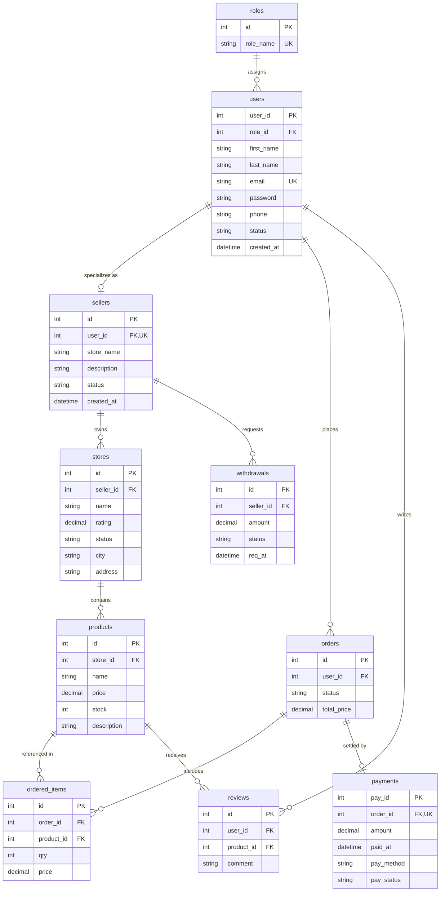

# OmniMarket DBMS – Multi-Vendor E-Commerce Marketplace

A full-stack, enterprise-grade Relational Database Management System (DBMS) implementation designed for a multi-vendor e-commerce marketplace platform.

This project couples a responsive, modern web interface with a high-performance **Python FastAPI** backend and a persistent **SQLite 3** relational database (`omnimarket.db`). It demonstrates core database management concepts including strict foreign-key referential integrity enforcement, complex SQL queries (`JOIN`, `GROUP BY`, `HAVING`, aggregations), full multi-table CRUD management, live EER diagram visualizer, and an interactive SQL Query Console.

---

## 🌟 Features

- **Live Relational Dashboard**: Real-time aggregated database statistics (`total_users`, `total_sellers`, `total_stores`, `total_products`, `total_orders`, `total_revenue`, `pending_withdrawals`, `total_reviews`) fetched dynamically via backend SQL queries.
- **Interactive SQL Console**: Educational SQL execution console connecting to `POST /api/sql`. Features include:
  - Raw SQL query execution against `omnimarket.db`.
  - 11 pre-loaded relational SQL query preset chips.
  - Session query history logging with execution metrics (timing in ms).
  - One-click query reloading and editor resetting.
- **Full 10-Table CRUD Operations**: Complete `CREATE`, `READ`, `UPDATE`, and `DELETE` capability across all marketplace entity domains (Users, Roles, Sellers, Stores, Products, Orders, Ordered Items, Payments, Withdrawals, Reviews).
- **Live EER Schema Visualizer**: Dynamically inspects database DDL and referential constraints via `GET /api/verification` using SQLite `PRAGMA table_info` and `PRAGMA foreign_key_list`. Includes an entity attribute breakdown and referential constraint summary matrix.
- **Strict Foreign Key Referential Integrity**: Enforces `PRAGMA foreign_keys = ON;` at the database connection layer to prevent orphaned records or invalid updates.
- **Auto-Generated API Documentation**: Interactive Swagger UI provided by FastAPI at `/docs`.

---

## 🛠️ Technology Stack

| Component | Technology | Description |
| :--- | :--- | :--- |
| **Frontend** | HTML5 / CSS3 / Vanilla JavaScript | Glassmorphic responsive interface with asynchronous Fetch API calls |
| **Backend Framework** | Python 3.12 / FastAPI | High-performance, asynchronous RESTful API framework |
| **Database** | SQLite 3 (`omnimarket.db`) | Embedded relational database with foreign key support |
| **Database Driver** | Standard `sqlite3` module | Python native database driver |
| **Web Server** | Uvicorn | Lightning-fast ASGI server implementation |
| **Data Validation** | Pydantic v2 | Python type validation and schema definition |

---

## 📊 Database Design

The system models a multi-vendor marketplace using **10 normalized relational tables**:

| Table Name | Primary Key | Description & Purpose |
| :--- | :--- | :--- |
| **`roles`** | `id` | Defines access control roles (e.g., Admin, Seller, Buyer). |
| **`users`** | `user_id` | Stores user account profile credentials, contact info, and assigned role (`role_id`). |
| **`sellers`** | `id` | Disjoint entity tracking vendor profile details linked 1-to-1 with a user account (`user_id`). |
| **`stores`** | `id` | Represents individual storefronts owned by sellers (`seller_id`), including ratings and location. |
| **`products`** | `id` | Catalog items published within stores (`store_id`), tracking pricing and stock inventory. |
| **`orders`** | `id` | Customer purchase orders placed by users (`user_id`), tracking order status and order total. |
| **`ordered_items`** | `id` | Junction table mapping products (`product_id`) to orders (`order_id`) with quantities and locked prices. |
| **`payments`** | `pay_id` | Payment transactions linked 1-to-1 with purchase orders (`order_id`). |
| **`withdrawals`** | `id` | Financial payout requests initiated by sellers (`seller_id`) for earnings withdrawals. |
| **`reviews`** | `id` | Customer feedback and ratings linking users (`user_id`) to products (`product_id`). |

---

## 🔗 Entity Relationships

### Referential Constraints & Foreign Keys
- **`users.role_id`** → `roles.id` (Many-to-One)
- **`sellers.user_id`** → `users.user_id` (One-to-One Unique)
- **`stores.seller_id`** → `sellers.id` (Many-to-One)
- **`products.store_id`** → `stores.id` (Many-to-One)
- **`orders.user_id`** → `users.user_id` (Many-to-One)
- **`ordered_items.order_id`** → `orders.id` (Many-to-One)
- **`ordered_items.product_id`** → `products.id` (Many-to-One)
- **`payments.order_id`** → `orders.id` (One-to-One Unique)
- **`withdrawals.seller_id`** → `sellers.id` (Many-to-One)
- **`reviews.user_id`** → `users.user_id` (Many-to-One)
- **`reviews.product_id`** → `products.id` (Many-to-One)

### Mermaid Entity-Relationship (ER) Diagram



---

## 🏗️ System Architecture

```
+-------------------------------------------------------------+
|                      User Web Browser                       |
|               (http://localhost:5500/#dashboard)            |
+-------------------------------------------------------------+
                              |
                              | Asynchronous HTTP / JSON (Fetch API)
                              v
+-------------------------------------------------------------+
|                     FastAPI REST Backend                    |
|                (Python 3.12 on Port 8000)                   |
|  - CORS Middleware enabled                                  |
|  - REST Endpoints (/api/products, /api/users, etc.)         |
|  - SQL Console Execution Endpoint (/api/sql)                |
|  - Verification & Schema Endpoint (/api/verification)       |
+-------------------------------------------------------------+
                              |
                              | sqlite3 Connector (PRAGMA foreign_keys = ON)
                              v
+-------------------------------------------------------------+
|                  SQLite Relational Database                 |
|                   (backend/omnimarket.db)                   |
|  - 10 Relational Tables                                     |
|  - Foreign Key Constraints & Triggers                       |
+-------------------------------------------------------------+
```

---

## 📂 Project Structure

```
DBMS-PROJ/
├── README.md                  # Comprehensive Project Documentation
├── .gitignore                 # Git ignore file for Python bytecode & temporary files
├── index.html                 # Root Frontend Web Application
├── frontend/
│   └── index.html             # Dedicated Frontend Web Application Entrypoint
└── backend/
    ├── main.py                # FastAPI Application & REST Route Handlers
    ├── database.py            # SQLite Helper Module, Schema Initialization & Verification
    ├── schema.sql             # Relational Database DDL Definitions (10 Tables)
    ├── requirements.txt       # Backend Dependency Manifest (fastapi, uvicorn, pydantic)
    └── omnimarket.db          # Persistent SQLite Relational Database File
```

---

## 🚀 Installation and Setup

### Prerequisites
- **Python 3.8+** installed on your system.
- Web browser (Chrome, Firefox, Edge, or Safari).

---

### Step 1: Clone the Repository
```bash
git clone https://github.com/naveendrang-cyber/DBMS-PROJ.git
cd DBMS-PROJ
```

---

### Step 2: Set Up and Start the FastAPI Backend

Open a terminal window and navigate to the project directory:

```bash
cd backend
pip install -r requirements.txt
python -m uvicorn backend.main:app --reload --port 8000
```

> The FastAPI backend server will start running at **`http://localhost:8000`**.

---

### Step 3: Start the Frontend HTTP Server

Open a second terminal window in the project directory:

```bash
cd frontend
python -m http.server 5500
```

> The Web Application will be accessible at **`http://localhost:5500`**.

---

### Step 4: Access Application Interfaces

- **Frontend User Interface**: [http://localhost:5500](http://localhost:5500)
- **Backend API Base URL**: [http://localhost:8000/api](http://localhost:8000/api)
- **FastAPI Interactive API Docs (Swagger)**: [http://localhost:8000/docs](http://localhost:8000/docs)
- **Backend Health Check**: [http://localhost:8000/api/health](http://localhost:8000/api/health)

---

## 💻 SQL Console & Query Examples

The built-in **SQL Console** allows running raw SQL queries directly against `backend/omnimarket.db` through `POST /api/sql`.

### 1. SELECT Query (Basic Retrieval)
```sql
SELECT user_id, first_name, last_name, email, status 
FROM users;
```

### 2. JOIN Query (Product & Store Details)
```sql
SELECT p.name AS product_name, p.price, p.stock, s.name AS store_name, s.city
FROM products p
JOIN stores s ON p.store_id = s.id;
```

### 3. GROUP BY & Aggregation (Store Revenue Analysis)
```sql
SELECT s.name AS store_name, COUNT(p.id) AS total_products, AVG(p.price) AS avg_product_price
FROM stores s
LEFT JOIN products p ON s.id = p.store_id
GROUP BY s.id, s.name;
```

---

## 🔄 UPDATE Operation Example

Updating record attribute values directly affects `omnimarket.db`.

### SQL UPDATE Example
Update product pricing and inventory stock levels:

```sql
UPDATE products
SET price = 1299.99, stock = 45
WHERE id = 1;
```

### Verification Query
```sql
SELECT id, name, price, stock 
FROM products 
WHERE id = 1;
```

---

## ❌ DELETE Operation Example

Removing records from tables while maintaining referential integrity.

### SQL DELETE Example
Delete a review entry safely from the database:

```sql
DELETE FROM reviews
WHERE id = 1;
```

### Foreign Key Integrity Safety Feature
If you attempt to delete a parent entity with active foreign key children (such as a user with existing orders):

```sql
DELETE FROM users
WHERE user_id = 1;
```

**Result**: SQLite returns an error due to active foreign key constraints (`PRAGMA foreign_keys = ON;`), protecting data consistency:
```json
{
  "detail": "Cannot delete: Foreign key constraint failed. Related child records exist in another table."
}
```

---

## 🌐 API Endpoints Reference

| HTTP Method | Endpoint | Description |
| :--- | :--- | :--- |
| `GET` | `/api/health` | Backend server & database health check |
| `GET` | `/api/verification` | Live SQLite schema metadata & integrity report |
| `GET` | `/api/dashboard/stats` | Aggregated dashboard metric counts |
| `POST` | `/api/sql` | Raw SQL query execution endpoint |
| `GET` | `/api/{table_name}` | Fetch all records for any table |
| `POST` | `/api/{table_name}` | Insert a new record into a table |
| `PUT` | `/api/{table_name}/{id}` | Update an existing record by primary key |
| `DELETE` | `/api/{table_name}/{id}` | Delete a record by primary key |

---

## 📜 License & Project Academic Disclaimer

This project is created for educational purposes as part of the **Database Management Systems (DBMS)** Mini-Project / Lab Assessment (DA2). All database schemas, API routes, and interface features are designed to reflect real-world relational marketplace architectures.
